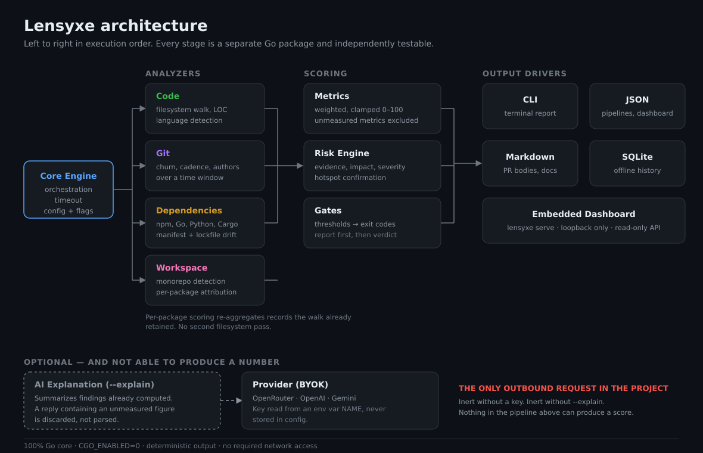

<div align="center">


</div>

```text
█░░ █▀▀ █▄░█ █▀ █▄█ ▀▄▀ █▀▀
█▄▄ ██▄ █░▀█ ▄█ ░█░ █░█ ██▄
Engineering Intelligence for Software Repositories
```

**Deterministic engineering intelligence for your codebase.**

Lensyxe measures a repository's code structure, dependency surface, and git
maintainability, and produces a single 0–100 Engineering Health Score you can
act on and gate CI on.

Every finding names the file, the number, and the threshold it crossed, because
a score you cannot trace to a line of code is a colour rather than an action.

It runs entirely on your machine. There is no telemetry, no account, and no
upload. The same tree always produces the same score.

```
lensyxe 0.3.0  engineering intelligence
path    /home/you/widget
scanned 2026-10-05T12:04:31Z in 126 ms
--------------------------------------------------------------

ENGINEERING HEALTH
   87.4 / 100   B
  █████████████████░░░
  Overall healthy (87.4/100). Weakest dimension: Code health at 82.5.
  Code health             82.5     57%
  Dependency health       94.0     43%
  Maintainability (Git)      -       -

RISKS (2)
  🔴 CRIT Confirmed hotspot  (-12.0 pts)
    subject  internal/engine.go
    LOC                    900 code lines
    Churn                  412 lines modified in the git window
    Complexity             31 estimated cyclomatic complexity (very_high)
    -> Reduce this file below 500 lines, or extract its highest-churn region.

  🟠 HIGH Code health below expectations  (-7.5 pts)
    Code health      82.5/100 at 57% weight
```

---

## Quickstart

```bash
# What is the state of this repository?
lensyxe analyze .

# Just the headline, in a few lines. Same analysis, shorter output.
lensyxe status

# What did this branch do to the score since the tag?
lensyxe diff v1.0.0 HEAD

# The trend over time, from a local SQLite file inside the repository.
lensyxe log

# The dashboard, served from loopback by the same binary.
lensyxe serve --open

# The gate. Exit 0 clean, 1 broken, 2 threshold breached.
lensyxe analyze . --fail-under-health 75

# Optional: propose a config file measured from this repository.
# Prints a proposal; writes nothing without --write.
lensyxe setup
```

There is nothing else to install: no database server, no daemon, no account, no
configuration file required. The first command is the whole product.

`diff`, `log`, `st`, `an`, `lg`, `df`, `w`, and `ui` are aliases for
`compare`, `history`, `status`, `analyze`, `history`, `compare`, `watch`, and
`serve` respectively, so the spellings you already have in your fingers work
here.

---

## Install

```bash
curl -sSL https://raw.githubusercontent.com/zelvior/lensyxe/main/install.sh | bash
```

The installer detects your platform, verifies the download against the release's
SHA-256 `checksums.txt`, and refuses to continue on a mismatch.

Pin a release, or install into your home directory instead of
`/usr/local/bin`:

```bash
curl -sSL .../install.sh | LENSYXE_VERSION=0.3.0 bash
curl -sSL .../install.sh | LENSYXE_PREFIX=$HOME/.local/bin bash
```

<details>
<summary>Other install methods</summary>

**Go install**

```bash
go install github.com/zelvior/lensyxe/cmd/lensyxe@latest
```

**Download a release**

Grab the archive for your platform from
[releases](https://github.com/zelvior/lensyxe/releases) and verify it:

```bash
sha256sum -c checksums.txt
```

**Build from source**

Requires Go 1.22 or newer.

```bash
git clone https://github.com/zelvior/lensyxe.git
cd lensyxe
go build ./cmd/lensyxe
```

</details>

---

## What it measures

| Dimension | Weight | Based on |
| :--- | ---: | :--- |
| Code health | 40% | Average file size (two-sided), hotspot concentration, language cohesion |
| Dependency health | 30% | Declared count, lockfile presence, ecosystem spread |
| Maintainability (git) | 30% | Commit cadence, recency, churn concentration, bus factor |

Weights are renormalized across whatever is applicable, so a directory that is
not a git repository is still scored on the dimensions it *can* be judged on
rather than being punished for having no history.

Risks are evidence-first. Every one carries the numbers behind it, so you can
check the claim without re-running anything.

Full arithmetic: **[docs/SCORING_SPEC.md](docs/SCORING_SPEC.md)**.

---

## Commands

| Command | What it does |
| :--- | :--- |
| [`lensyxe analyze`](docs/CLI_REFERENCE.md#lensyxe-analyze) | Score a repository. The main entry point. |
| [`lensyxe status`](docs/CLI_REFERENCE.md#lensyxe-status) | The same score in a few lines. Does not record a run. |
| [`lensyxe setup`](docs/CLI_REFERENCE.md#lensyxe-setup) | Propose a `.lensyxe.yml` from a measurement of this repository. Writes nothing without `--write`. |
| [`lensyxe blast`](docs/CLI_REFERENCE.md#lensyxe-blast) | Which files historically change together with the ones you are changing. |
| [`lensyxe cognitive`](docs/CLI_REFERENCE.md#lensyxe-cognitive) | A 0-100 friction index from variable lifetime, call density, and scope depth. |
| [`lensyxe decay`](docs/CLI_REFERENCE.md#lensyxe-decay) | Files that stopped changing, single-author silos, and activity half-life. |
| [`lensyxe topology`](docs/CLI_REFERENCE.md#lensyxe-topology) | Recency-weighted bus factor, hidden co-change coupling, package boundary violations. |
| [`lensyxe gap`](docs/CLI_REFERENCE.md#lensyxe-gap) | Static complexity against real runtime execution, from a pprof, OTel export, or access log. |
| [`lensyxe compare`](docs/CLI_REFERENCE.md#lensyxe-compare) | Compare two revisions via `git archive`, without touching the working tree. |
| [`lensyxe history`](docs/CLI_REFERENCE.md#lensyxe-history) | Plot the recorded health timeline. Also spelled `log`. |
| [`lensyxe watch`](docs/CLI_REFERENCE.md#lensyxe-watch) | Re-analyze on every change and stream the movement. |
| [`lensyxe serve`](docs/CLI_REFERENCE.md#lensyxe-serve) | Local dashboard and JSON API in one process. |
| `lensyxe version` | Build metadata: commit, build date, toolchain, platform. |

---

## Output formats

### Terminal

Colored, with the score bar and every figure explained.

### Markdown

No ANSI escapes, so it pastes cleanly into a pull request or a docs site.

```bash
lensyxe analyze --format markdown
```

### JSON

Full risk evidence payloads. Stable schema, `schema_version` in the document.

```bash
lensyxe analyze --format json --no-persist | jq '.health.score'
```

---

## Monorepos

```bash
lensyxe analyze . --monorepo
```

```
WORKSPACE (npm, 4 packages)
  apps/docs               86.3  B (unlocked dependencies)
  apps/web                85.4  B (unlocked dependencies)
  packages/core           78.1  F (2 confirmed hotspots)
  packages/ui             92.0  A
```

Detected from `pnpm-workspace.yaml`, `lerna.json`, `go.work`, a root
`Cargo.toml` with `[workspace]`, or a root `package.json` with `workspaces`.

Each package is scored by the same scorer on that package's own files. **Git
signals are not attributed per package**: commit cadence and bus factor describe
the repository, not a directory. Package scores carry the code and dependency
weights only, and every report says so.

No second filesystem pass: the breakdown reuses records the main walk already
produced.

---

## The dashboard

```bash
lensyxe serve --open
```

One process serves the dashboard and the API on `localhost:7357`. The UI is a
static export embedded in the binary with `//go:embed`, so there is no asset
directory to deploy and no second runtime to keep alive.

```
GET /api/v1/health      current snapshot and sub-scores
GET /api/v1/history     recorded snapshots, oldest first
GET /api/v1/risks       risks with evidence payloads
GET /api/v1/hotspots    churn and complexity hotspots
```

The listener binds to loopback. API responses are `no-store` and cross-origin
requests are refused: nothing on the internet is a legitimate caller of an API
that returns repository internals.

---

## CI integration

### As a GitHub Action

```yaml
name: Lensyxe
on: pull_request:

permissions:
  contents: read
  pull-requests: write

jobs:
  health:
    runs-on: ubuntu-latest
    steps:
      - uses: zelvior/lensyxe-action@v1
        with:
          fail-under-health: 70
          fail-on-critical-risk: true
```

Posts a PR comment with metric deltas and fails the build on a breach.
Full guide: **[docs/GITHUB_ACTION.md](docs/GITHUB_ACTION.md)**.

### As a plain command

```bash
lensyxe analyze . --format json --no-persist --fail-under-health 70
```

### Exit codes

| Code | Meaning |
| ---: | :--- |
| `0` | Success |
| `1` | Failure: bad path, crash, usage error |
| `2` | Policy rejection: a configured threshold was breached |

`2` is deliberately distinct from `1`, so a pipeline can tell "the gate
rejected this code" from "something broke".

**The report is printed and the snapshot recorded before the gate is evaluated.**
A rejected run still leaves evidence of what it looked like — a gate that
erased its own evidence would be the worst possible outcome.

### Policies in the config file

```yaml
# .lensyxe.yml
min_health_score: 70
max_health_drop: 5
require_tests: true
fail_on_drift: true
```

Numeric thresholds use an unset sentinel of `-1` rather than zero, so
`max_risk_count: 0` means "no risks tolerated" rather than "the rule is off".

Full schema: **[docs/CONFIGURATION.md](docs/CONFIGURATION.md)**.

---

## Workflow linting

Lensyxe reads its own CI configuration.

```bash
lensyxe analyze . --workflow-fail-severity high
```

Detects unpinned third-party actions, `permissions: write-all`,
`pull_request_target` combined with a privileged checkout, missing build
caching, constant matrix axes, excessive fan-out, and missing timeouts.

---

## Optional: AI explanations

```bash
export LENSYXE_AI_KEY=sk-...
export LENSYXE_AI_PROVIDER=openai
lensyxe analyze --explain
```

Providers: OpenRouter, OpenAI, Gemini.

**The model cannot touch a number.** It rewrites figures the engine already
produced into prose. It never computes a score, derives a metric, or invents a
measurement — and every figure in its reply is checked against the figures it
was given. A summary containing an unmeasured number is **discarded with an
error**, not shown. The prompt carries aggregate statistics, never source code.

The output is labelled as generated, the score is unaffected, and a provider
outage cannot fail your analysis.

---

## Architecture



The pipeline runs left to right and the order is load-bearing — each stage
consumes the previous stage's output, and two of them cannot work in a different
sequence. Scoring is pure arithmetic with no I/O, which is what makes it
testable without a filesystem.

```
cmd/lensyxe/            CLI: cobra commands, exit-code mapping
├── server/              embedded dashboard + JSON API
├── ci/                  workflow linting, PR comment generation
└── explain.go           BYOK AI layer

internal/
├── analyzer/            concurrent orchestration
├── code/                file walk, LOC, lexical complexity, hotspots
├── git/                 churn, cadence, bus factor
├── dependencies/        npm, gomod, python manifests and lockfiles
├── metrics/             the scorer — pure arithmetic, no I/O
├── risk/                evidence-first risk engine
├── monorepo/            workspace detection, per-package scoring
├── gates/               threshold evaluation (pure)
├── storage/             SQLite history
├── history/             timeline rendering
├── report/              terminal, markdown, JSON
├── compare/             revision comparison
├── watch/               filesystem watcher
├── config/              .lensyxe.yml loading
└── server/              HTTP handlers, //go:embed

pkg/models/              the JSON contract, shared by every layer
dashboard/               Next.js static export (embedded, not served separately)
```

### Design constraints

These are enforced by tests, not by convention:

- **The scorer is pure.** `internal/metrics` has no I/O, no clock, and no
  randomness. Same input, same output, always.
- **Evidence-first risks.** Every risk carries the numbers behind it.
- **No invented metrics.** Where a value cannot be measured honestly, the output
  says *not measured* rather than printing a plausible number. See
  [What is not measured](docs/SCORING_SPEC.md#what-is-not-measured).
- **Deterministic output.** Sorted with total orderings; no map iteration order
  reaches stdout.
- **Local-first.** The only outbound request in the project is the optional
  `--explain` layer, which is off unless you supply a key.
- **Tested against the real binary.** `tests/` runs the compiled CLI through
  `exec.Command`, so exit codes, flag precedence, and the HTTP API are verified
  end to end rather than inferred from unit tests of the pieces.

---

## What it does not measure

Stated plainly, because a tool that implies it measures something it does not is
worse than one that measures less.

| Not measured | What exists instead |
| :--- | :--- |
| **Code coverage** | Test-to-code **file ratio** — a different, weaker signal, never called coverage. |
| **Build duration** | Nothing. Lensyxe does not execute your build. |
| **Vulnerabilities** | Nothing. That needs a database and a network call. |
| **Complexity for YAML/SQL config** | Excluded entirely rather than estimated. |
| **Per-package git signals** | Not attributable to a directory. |

---

## Documentation

| Document | What is in it |
| :--- | :--- |
| [docs/CLI_REFERENCE.md](docs/CLI_REFERENCE.md) | Every command, flag, and exit code. |
| [docs/SCORING_SPEC.md](docs/SCORING_SPEC.md) | The scoring formulas and thresholds exactly, including [what is not measured](docs/SCORING_SPEC.md#what-is-not-measured). |
| [docs/CONFIGURATION.md](docs/CONFIGURATION.md) | Every `.lensyxe.yml` key and its default. |
| [docs/GITHUB_ACTION.md](docs/GITHUB_ACTION.md) | Action inputs, permissions, and the `pull_request_target` hazard. |
| [docs/ROADMAP.md](docs/ROADMAP.md) | Where the project is going, and what it has decided not to do. |
| [docs/VSCODE_EXTENSION.md](docs/VSCODE_EXTENSION.md) | The editor extension: build, install, settings, and how it stays non-blocking. |
| [docs/MAINTAINERS.md](docs/MAINTAINERS.md) | Triage rules, tagging conventions, the release checklist, and advisory response. |
| [docs/LAUNCH_ANNOUNCEMENT.md](docs/LAUNCH_ANNOUNCEMENT.md) | Announcement copy, with every claim traced to its evidence. |
| [CONTRIBUTING.md](CONTRIBUTING.md) | Architecture, development setup, and testing rules. |
| [SECURITY.md](SECURITY.md) | Local-first guarantees and how to report a vulnerability. |
| [CHANGELOG.md](CHANGELOG.md) | What shipped. |
| [CODE_OF_CONDUCT.md](CODE_OF_CONDUCT.md) | Contributor Covenant 2.1. |
| [web/](web/) | The marketing and setup site. Static, no build step, deploys to Vercel. |

The documentation is tested. `cmd/lensyxe/docs_test.go` builds the real command
tree and asserts that every flag exists, is documented, and that the config keys,
scoring constants, and Action inputs quoted in these files match the source. If
you change one of those, the tests will tell you which page to update.

The site in [`web/`](web/) is checked by `scripts/check-web.go`, which resolves
every local reference and heading anchor, restricts off-site links to this
project's own URLs, and asserts `vercel.json` declares the security headers the
site relies on.

---

## Contributing

```bash
git clone https://github.com/zelvior/lensyxe.git
cd lensyxe
go test ./...
go build ./cmd/lensyxe
```

Tests must pass with `go vet ./...` clean and `gofmt -l .` empty. The race
detector needs cgo and a C toolchain:

```bash
CGO_ENABLED=1 go test -race ./...
```

### Test layout

| Location | What it covers |
| :--- | :--- |
| `internal/*/[name]_test.go` | The package's own behaviour, including boundary conditions. |
| `internal/report/golden_test.go` | Byte-exact report output, compared against `testdata/golden/`. |
| `tests/integration_test.go` | End-to-end runs of the real binary: exit codes, config precedence, the HTTP API. |
| `tests/benchmark_test.go` | Performance budgets that fail a test rather than printing a number. |
| `tests/profile_test.go` | Attributes analysis cost to its parts, so a budget breach is diagnosable. |
| `examples/` | Small committed fixtures whose expected output is known by construction. |

`tests/` runs the compiled CLI through `exec.Command` rather than calling the
command tree in-process, because exit codes and argument parsing are properties
of the process and an in-process call cannot observe them.

### Measuring coverage

```bash
go test -coverpkg=./cmd/...,./internal/...,./pkg/... -coverprofile=cov.out ./cmd/... ./internal/... ./pkg/...
go tool cover -func=cov.out
```

The `-coverpkg` list is not incidental. `examples/` contains test fixtures, and
`examples/risky-go` is *supposed* to have no test files: it is the fixture that
proves the `--require-tests` gate rejects a repository with no tests. Give it a
test file to raise the coverage number and you have silently broken the fixture
and every assertion built on it.

Because it has no tests, `go test ./...` still instruments its 446 statements and
counts every one of them as uncovered. That drags the whole-module total down by
about eight points for no reason other than a fixture doing its job. Restricting
`-coverpkg` to the shipped packages measures what is actually shipped.

### Golden files

Report output is pinned byte-for-byte in `internal/report/testdata/golden/`. To
regenerate after an intentional layout change:

```bash
go test ./... -update
```

A **missing** golden file is a failure, not an implicit creation. A golden that
appears without anyone reviewing it has not been shown to be correct, and
accepting one would let a broken renderer define its own expected output.

The goldens are deterministic because `internal/report`'s `TestMain` pins the
terminal colour profile. Without that, lipgloss detects colour from `os.Stdout`
and the same snapshot emits ANSI codes on a developer machine and plain text in
CI, so the golden would match in one place and fail in the other.

### Performance budgets

```bash
go test ./tests/                              # enforces the budgets
go test -run='^$' -bench=. -benchmem ./tests/  # measures them
```

The 200 ms target applies to the **code walk**, not end to end. An end-to-end
run is dominated by git subprocess spawns: measured on a 40-file fixture, about
900 ms total of which roughly 26 ms is actual analysis and 86% is the git
analyzer paying process-creation cost per call. That overhead is an operating
system property and differs by an order of magnitude between Linux and Windows,
so a 200 ms end-to-end budget would pass in CI and fail on developer machines.
`TestProfileAnalysisCost` prints the split if you want to see it.

Budgets are flags, so a slow machine does not need a code change:

```bash
go test ./tests/ -budget.code-walk=500ms -budget.end-to-end=5s
```

### Adding a test package

Every test package must register the `-update` flag. Go passes an unrecognized
flag to every test binary it builds, so a package without the registration makes
`go test ./... -update` fail outright:

```bash
pwsh scripts/make-golden-flags.ps1
```

### Fixtures

`examples/` holds small committed projects whose properties are documented and
asserted: `healthy-go` scores well, `risky-go` has one oversized file and no
tests, `npm-workspace` has manifests and no lockfile. The bulk of
`examples/risky-go/legacy/order.go` is generated, because a 900-line hand-written
file would be unreviewable:

```bash
go run scripts/gen-risky-example.go
```

The benchmark fixtures under `tests/` are generated into a temporary directory at
run time rather than committed, so they can scale from 40 files to 2,000 without
checking in thousands of files.

### Dashboard

To rebuild the embedded dashboard after changing anything under `dashboard/`:

```bash
cd dashboard && npm install && npm run build && cd ..
cp -r dashboard/out/. internal/server/assets/
go build ./cmd/lensyxe
```

---

## License

MIT. See [LICENSE](LICENSE).